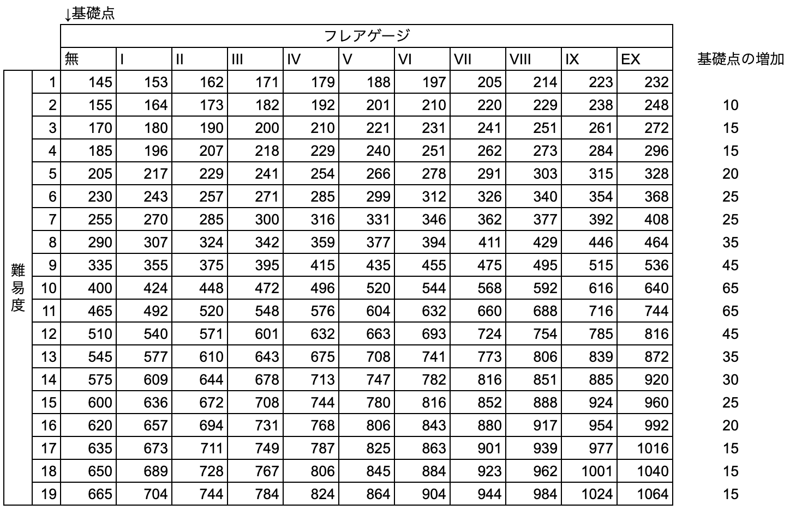

# GALAXY Theme

Custom theme for modern StepMania forks.

## Simulators

Developed and tested with the following StepMania forks:

- [ITGmania](https://www.itgmania.com/)
    - Recommended version [v1.2.1](https://github.com/itgmania/itgmania/releases/tag/v1.2.1)+.
- [OutFox](https://projectoutfox.com/)
    - Recommended version [LTS-4.19.0](https://github.com/TeamRizu/OutFox/releases/tag/OF4.19.0). I do not recommend using this theme with AlphaV-0.5.0 pre-release versions.

## Noteskins

Recommended for use with Schneider's notekins:
- [Schneider's DDR HD Noteskins](https://github.com/SchneiderAFX/Schneiders-DDR-HD-Noteskins)

## Settings

### Timing

Three timing presets are available, selectable per-session. `StepMania` resets to engine defaults.

See [`Scripts/00 Timing.lua`](Scripts/00%20Timing.lua).

| Window                 | StepMania | ITG    | DDR Extreme | DDR Modern |
|------------------------|-----------|--------|-------------|------------|
| Marvelous (W1)         | ±22.5ms   | ±21.5ms | ±13.3ms    | ±16.67ms   |
| Perfect (W2)           | ±45ms     | ±43ms   | ±26.6ms    | ±33.33ms   |
| Great (W3)             | ±90ms     | ±102ms  | ±80ms      | ±91.67ms   |
| Good (W4)              | ±135ms    | ±135ms  | ±120ms     | ±141.67ms  |
| Boo (W5)               | ±180ms    | ±180ms  | ±166.6ms   | N/A  |
| Hold                   | ±250ms  | ±320ms| ±250ms   | ±250ms   |
| Mine                   | ±70ms   | ±70ms | ±90ms    | ±90ms    |
| Roll                   | ±350ms  | ±350ms| ±500ms   | ±500ms   |

**Combo breaking**: The theme sets `MinScoreToContinueCombo=W4` globally ([`metrics.ini`](metrics.ini#L105)), so W1–W4 continue combo and W5/Miss break it. This threshold applies to all timing modes uniformly. This means DDR Extreme/Modern behave correctly, but ITG/StepMania combos might be incorrect.

### Flare Gauge Penalties

Flare gauges apply drain penalties on judgments below Marvelous. Values are inherited from [stepmania-ddr-5_1-new](https://github.com/celunah/stepmania-ddr-5_1-new) (`LifeMeterBar.h`). Index 1 = Flare I, index 10 = Flare EX.

See [`Scripts/04 GaugeState.lua`](Scripts/04%20GaugeState.lua).

**Tap penalties** (negative = drain):

| Judgment | I       | II      | III     | IV      | V      | VI     | VII    | VIII   | IX    | EX    |
|----------|---------|---------|---------|---------|--------|--------|--------|--------|-------|-------|
| W1       | 0       | 0       | 0       | 0       | 0      | 0      | 0      | 0      | 0     | 0     |
| W2       | 0       | 0       | 0       | 0       | 0      | 0      | 0      | 0      | 0     | -0.01 |
| W3       | -0.001  | -0.001  | -0.001  | -0.0029 | -0.0074| -0.0092| -0.0128| -0.0164| -0.02 | -0.02 |
| W4       | -0.0063 | -0.0063 | -0.0075 | -0.0145 | -0.038 | -0.045 | -0.064 | -0.082 | -0.1  | -0.1  |
| Miss     | -0.015  | -0.03   | -0.045  | -0.11   | -0.16  | -0.18  | -0.22  | -0.26  | -0.3  | -0.3  |

**Hold penalties**:

| Judgment   | I      | II    | III   | IV   | V    | VI   | VII  | VIII | IX   | EX   |
|------------|--------|-------|-------|------|------|------|------|------|------|------|
| Held       | 0      | 0     | 0     | 0    | 0    | 0    | 0    | 0    | 0    | 0    |
| MissedHold | 0      | 0     | 0     | 0    | 0    | 0    | 0    | 0    | 0    | 0    |
| LetGo      | -0.015 | -0.03 | -0.045| -0.11| -0.16| -0.18| -0.22| -0.26| -0.3 | -0.3 |

### Flare Points

Values were determined by the community, values may need correction., [see this twitter posts](https://x.com/ekarunian/status/1801547494394106359).

See [`Scripts/05 ChartResults.lua`](Scripts/05%20ChartResults.lua).

### Sorting

This theme allows custom sorting of Latin and Japanese characters. Characters are grouped into three categories: J = Japanese, L = Latin, N = Numbers and special characters. Any permutation of these three is available, eg. `J,L,N` sorts Japanese characters first, then Latin, then numbers. A final option `romaji` romanizes the Japanese characters so they will appear mixed with English language titles.

See [`Scripts/02 ThemePrefs.lua`](Scripts/02%20ThemePrefs.lua) (JapaneseSorting) and [`BGAnimations/ScreenGalaxyMusic overlay.lua`](BGAnimations/ScreenGalaxyMusic%20overlay.lua) (SortKey/SortSongs).

Default: `J,L,N` (Japanese, then Latin, then Numbers), as in DDR A3.

**DDR version sort reference**:

| Game       | Region         | Sort Order |
|------------|----------------|------------|
| DDR A3     | Japan          | `J,L,N`      |
| DDR A3     | North America  | `J,L,N`      |
| DDR WORLD  | Japan          | `J,L,N`      |
| DDR WORLD  | North America  | `L,N,J`      |
